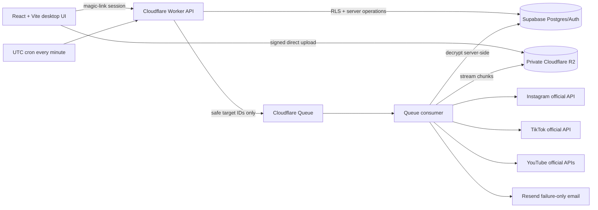

# Postline

Postline is an open-source, self-hosted scheduler for one owner to prepare, schedule, publish, and measure content across Instagram, TikTok, and YouTube. A single post can create independent platform targets, so (for example) an Instagram success never hides a TikTok failure.

It is not a centrally hosted SaaS. Each person clones and deploys a separate private instance with their own Supabase, Cloudflare, Resend, Meta, TikTok, and Google credentials.

> Status: the application, official-API adapters, migrations, security controls, tests, and deployment configuration are implemented and mock-tested. No platform connection or real publication was live-tested in this repository. Public posting remains deliberately blocked until the relevant provider approvals and `LIVE_TEST_CONFIRM=true` are configured.


## What it includes

- Supabase email magic-link authentication with one-owner authorization in the browser, Worker, and Row Level Security policies.
- Private R2 media, direct uploads, resumable multipart uploads, browser progress, randomized object keys, short-lived delivery URLs, and abandoned-upload cleanup.
- One-minute Cloudflare Cron claims with row locks, leases, stable idempotency keys, and Cloudflare Queue dispatch.
- Real official-API adapters for Meta Instagram Platform, TikTok Content Posting API, YouTube Data API v3, and YouTube Analytics API.
- No automatic retry after an API publish failure. An ambiguous result becomes `needs_review`; a definite failure requires an explicit manual retry.
- Deduplicated Resend email for failures and ambiguous outcomes—never for success.
- Server-paginated and browser-virtualized queues with no application-level record cap.
- Historical analytics snapshots, raw provider names, comparable metrics, trends, filters, and honest unavailable values.
- Desktop-first composer, queue, calendar, history, failures, account setup, settings, and customizable legal templates.

## Supported formats

| Platform  | Implemented types                                           | Important gate                                               |
| --------- | ----------------------------------------------------------- | ------------------------------------------------------------ |
| Instagram | Feed image, video, carousel, Reel, Story image, Story video | Professional account; app access/review as applicable        |
| TikTok    | Video and photo post/carousel                               | `video.publish`; public posts require completed TikTok audit |
| YouTube   | Standard video, Short candidate, optional custom thumbnail  | Unverified API projects upload privately until audit         |

“Short” is metadata in Postline, not a separate YouTube API endpoint. YouTube decides whether an uploaded video qualifies as a Short. See [the verified support matrix](docs/PLATFORM_SUPPORT_MATRIX.md) for accounts, scopes, endpoints, media limits, analytics, and verification date.

## Architecture



See [ARCHITECTURE.md](ARCHITECTURE.md) and [ADR 0001](docs/adr/0001-free-tier-first-stack.md).

## Quick local start

Requirements: Node.js 24+, Corepack, and pnpm 11.25. A full backend run also needs a Supabase project and Cloudflare resources.

```bash
corepack enable
pnpm install
cp .env.example .env
pnpm setup-doctor
pnpm dev
```

`.env.example` enables an explicitly labelled local UI demonstration. It cannot contact real platform APIs or report fake publications. Set `VITE_DEMO_MODE=false` and configure Supabase and the Worker for an authenticated integration environment.

Run the Worker separately:

```bash
cp .env.example apps/worker/.dev.vars
pnpm dev:worker
```

Do not put real secrets in `.env.example`, browser variables, source control, issue comments, build logs, or chat.

## Deploy your own private instance

1. Fork or clone this repository.
2. Follow [HUMAN_SETUP.md](HUMAN_SETUP.md) in order.
3. Create Supabase, run the ordered migrations, create only the owner auth user, and seed `installation_settings`.
4. Create the Cloudflare R2 bucket, queue, dead-letter queue, Worker, cron, and secrets.
5. Verify a Resend sender.
6. Register each platform app, add the exact callback URI, request only the documented scopes, and complete required reviews/audits.
7. Run `pnpm setup-doctor`, all checks, deploy the UI and Worker, then verify `/health`.
8. After the owner explicitly approves a controlled real test, set `LIVE_TEST_CONFIRM=true` and test one private/non-public item first where provider policy permits. Never claim public readiness until the audit permits it.

The complete path and rollback notes are in [DEPLOYMENT.md](DEPLOYMENT.md).

## Limits and cost

Postline does not impose a “10 scheduled posts” or other application-level cap. PostgreSQL records use cursor pagination and the interface uses virtualization. Unlimited means no artificial product limit—not infinite resources. Supabase database/storage/egress quotas, Cloudflare Worker/Queue/R2 limits, Resend email limits, provider media restrictions, API quotas, rate limits, daily posting caps, and developer-policy requirements still apply. Free plans and provider limits change; check the current provider dashboards before relying on them.

Source media is eligible for deletion seven days after every target succeeds. Any failed or ambiguous target retains media until the owner resolves or deletes it, and the UI calls out that storage risk.

## Honest verification status

| Surface                                                   | Implemented | Mock-tested               | Live-verified         |
| --------------------------------------------------------- | ----------- | ------------------------- | --------------------- |
| Instagram OAuth/publishing/status/analytics               | Yes         | Yes                       | No                    |
| TikTok OAuth/video/photo/status/analytics                 | Yes         | Yes                       | No                    |
| YouTube OAuth/resumable upload/status/thumbnail/analytics | Yes         | Yes                       | No                    |
| Supabase Auth/Postgres/RLS                                | Yes         | Migration/static tests    | No remote project     |
| Cloudflare Worker/Cron/Queue/R2                           | Yes         | Dry-run build/local logic | No deployment         |
| Resend failure email                                      | Yes         | Deduplication/logic tests | No sender credentials |

Mocks are injected only in tests. Production configuration fails closed and never activates mock publishing.

## Development

```bash
pnpm format:check
pnpm lint
pnpm typecheck
pnpm test
pnpm build
pnpm db:validate
pnpm test:e2e
pnpm audit
pnpm secrets:scan
```

Live integration tests are intentionally absent from the default test command and must never be triggered by CI. See [CONTRIBUTING.md](CONTRIBUTING.md).

## Security and policy

Review [SECURITY.md](SECURITY.md) before deployment. Never bypass app review, quotas, account restrictions, or public-visibility restrictions. Postline uses official APIs only—no passwords, scraping, Selenium, or browser automation for social publishing.

Customizable templates (not legal advice) are available at `/privacy`, `/terms`, and `/data-deletion`.

## Licence

[MIT](LICENSE)
