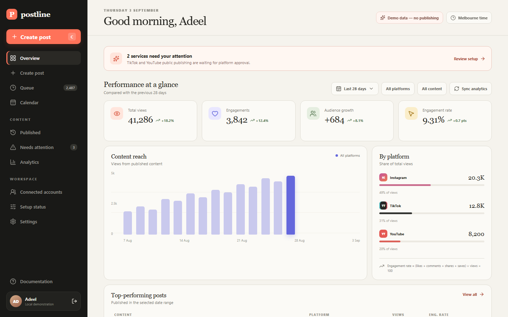
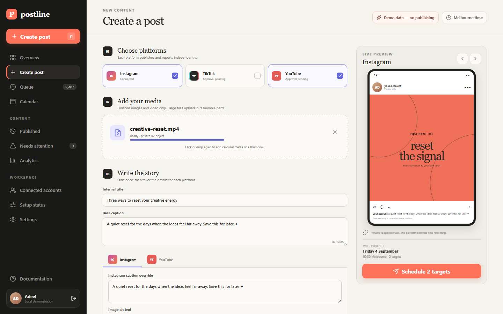
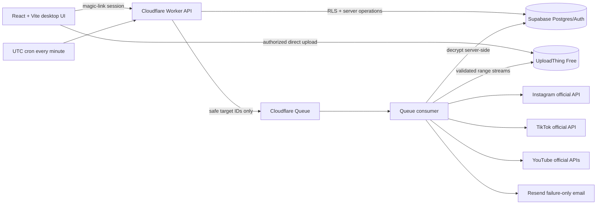

# Postline

Postline is an open-source, self-hosted scheduler for one owner to prepare, schedule, publish, and measure content across Instagram, TikTok, and YouTube. A single post can create independent platform targets, so (for example) an Instagram success never hides a TikTok failure.

It is not a centrally hosted SaaS. Each person clones and deploys a separate private instance with their own Supabase, Cloudflare, UploadThing, Resend, Meta, TikTok, and Google credentials.

> Status: the application, official-API adapters, migrations, security controls, tests, and deployment configuration are implemented and mock-tested. In Adeel's owner deployment, Supabase migration 003 is applied and the public Pages routes are deployed, while only an inert HTTP-503 Worker bootstrap serves API traffic; the real Worker version remains inactive. Authentication/RLS has not been live-tested end to end, and no social-platform connection or publication has been live-verified. Public posting remains deliberately blocked until the relevant provider approvals and `LIVE_TEST_CONFIRM=true` are configured.





## What it includes

- Supabase email magic-link authentication with one-owner authorization in the browser, Worker, and Row Level Security policies.
- Owner-authorized direct browser uploads to UploadThing, browser progress, a concurrency-safe 1.8 GiB active-media cap, signed delivery URLs, and abandoned-reservation cleanup.
- One-minute Cloudflare Cron claims with row locks, leases, stable idempotency keys, and Cloudflare Queue dispatch.
- Real official-API adapters for Meta Instagram Platform, TikTok Content Posting API, YouTube Data API v3, and YouTube Analytics API.
- No automatic retry after an API publish failure. An ambiguous result becomes `needs_review`; a definite failure requires an explicit manual retry.
- Deduplicated Resend email for failures and ambiguous outcomes—never for success.
- Server-paginated and browser-virtualized queues with no application-level record cap.
- Historical analytics snapshots, raw provider names, comparable metrics, trends, filters, and honest unavailable values.
- Desktop-first composer, queue, calendar, history, failures, account setup, settings, and configurable public legal policies.

## Supported formats

| Platform  | Implemented types                                           | Important gate                                               |
| --------- | ----------------------------------------------------------- | ------------------------------------------------------------ |
| Instagram | Feed image, video, carousel, Reel, Story image, Story video | Professional account; app access/review as applicable        |
| TikTok    | Video and photo post/carousel                               | `video.publish`; public posts require completed TikTok audit |
| YouTube   | Standard video, Short candidate, optional custom thumbnail  | Unverified API projects upload privately until audit         |

“Short” is metadata in Postline, not a separate YouTube API endpoint. YouTube decides whether an uploaded video qualifies as a Short. See [the verified support matrix](docs/PLATFORM_SUPPORT_MATRIX.md) for accounts, scopes, endpoints, media limits, analytics, and verification date.

## Architecture



See [ARCHITECTURE.md](ARCHITECTURE.md), [ADR 0001](docs/adr/0001-free-tier-first-stack.md), and [ADR 0002](docs/adr/0002-uploadthing-media-storage.md).

## Quick local start

Requirements: Node.js 24+, Corepack, and pnpm 11.25. A full backend run also needs a Supabase project and Cloudflare resources.

```bash
corepack enable
corepack pnpm install
cp .env.example .env
corepack pnpm setup-doctor
corepack pnpm dev
```

`.env.example` enables an explicitly labelled local UI demonstration. It cannot contact real platform APIs or report fake publications. Set `VITE_DEMO_MODE=false` and configure Supabase and the Worker for an authenticated integration environment.

Production builds also require the browser-safe `VITE_OPERATOR_NAME` and
`VITE_PUBLIC_CONTACT_EMAIL` values used on the public legal pages. Missing or
placeholder values fail the build when demo mode is off. Never put a server
secret in any `VITE_` variable.

Run the Worker separately:

```bash
cp .env.example apps/worker/.dev.vars
corepack pnpm dev:worker
```

Do not put real secrets in `.env.example`, browser variables, source control, issue comments, build logs, or chat.

## Deploy your own private instance

1. Fork or clone this repository.
2. Follow [HUMAN_SETUP.md](HUMAN_SETUP.md) in order.
3. Create Supabase, run the ordered migrations, create only the owner auth user, and seed `installation_settings`.
4. Create an UploadThing application on its free 2 GB plan and store its token only as a Worker secret.
5. Create the Cloudflare queue, dead-letter queue, Worker, cron, and remaining secrets. R2 is not used.
6. Verify a Resend sender.
7. Register each platform app, add the exact callback URI, request only the documented scopes, and complete required reviews/audits.
8. Run `corepack pnpm setup-doctor`, all checks, deploy the UI and Worker, then verify `/health`.
9. After the owner explicitly approves a controlled real test, set `LIVE_TEST_CONFIRM=true` and test one private/non-public item first where provider policy permits. Never claim public readiness until the audit permits it.

The complete path and rollback notes are in [DEPLOYMENT.md](DEPLOYMENT.md).

## Limits and cost

Postline does not impose a “10 scheduled posts” or other application-level queue cap. PostgreSQL records use cursor pagination and the interface uses virtualization. Unlimited means no artificial queue limit—not infinite resources. UploadThing Free provides finite 2 GB storage, and Postline rejects reservations above 1.8 GiB of active/outstanding media to leave operational headroom. Supabase, Cloudflare Worker/Queue, UploadThing, Resend, and social-provider quotas and policies still apply. Free plans and provider limits change; check the current provider dashboards before relying on them.

UploadThing Free files are public-readable to anyone who knows their opaque, hard-to-guess URL. Postline normally gives social providers a separate short-lived signed Worker URL, but that does not make the underlying UploadThing file private. Do not upload media that cannot safely have this exposure.

Source media is eligible for deletion seven days after every target succeeds. Any failed or ambiguous target retains media until the owner safely resolves/retries it and every selected target is published; the UI calls out that storage risk.

## Honest verification status

| Surface                                  | Source-code/mock verification                     | Adeel owner deployment (4 September 2026)                                        |
| ---------------------------------------- | ------------------------------------------------- | -------------------------------------------------------------------------------- |
| Instagram, TikTok, and YouTube adapters  | Implemented and mock-tested                       | No live connection or publication verified                                       |
| Supabase database schema                 | Ordered migrations and static validation          | Migration 003 applied                                                            |
| Supabase authentication and RLS behavior | Implemented and covered by migration/static tests | Not live-tested end to end                                                       |
| Cloudflare Worker, Cron, and Queues      | Worker dry-run and local logic verified           | Queues exist; safe HTTP-503 bootstrap is active; real Worker version is inactive |
| React/Vite frontend                      | Production build and browser E2E verified         | Pages deployment serves the public and legal routes                              |
| UploadThing media operations             | SDK integration mock-tested                       | No live storage workflow verified                                                |
| Resend failure email                     | Deduplication and delivery logic mock-tested      | No live sender delivery verified                                                 |

The deployment column records one maintainer installation, not the state of a
new clone. Source/mock results do not represent live provider verification.

Mocks are injected only in tests. Production configuration fails closed and never activates mock publishing.

## Development

```bash
corepack pnpm format:check
corepack pnpm lint
corepack pnpm typecheck
corepack pnpm test
corepack pnpm build:verify
corepack pnpm db:validate
corepack pnpm test:e2e
corepack pnpm audit --audit-level high
corepack pnpm secrets:scan
```

Live integration tests are intentionally absent from the default test command and must never be triggered by CI. See [CONTRIBUTING.md](CONTRIBUTING.md).

## Security and policy

Review [SECURITY.md](SECURITY.md) before deployment. Never bypass app review, quotas, account restrictions, or public-visibility restrictions. Postline uses official APIs only—no passwords, scraping, Selenium, or browser automation for social publishing.

Public policies are available without authentication at `/privacy`, `/terms`,
and `/data-deletion`. Installers remain responsible for reviewing their own
deployment and obtaining legal advice where needed; the open-source project
does not provide legal advice.

## Licence

[MIT](LICENSE)
